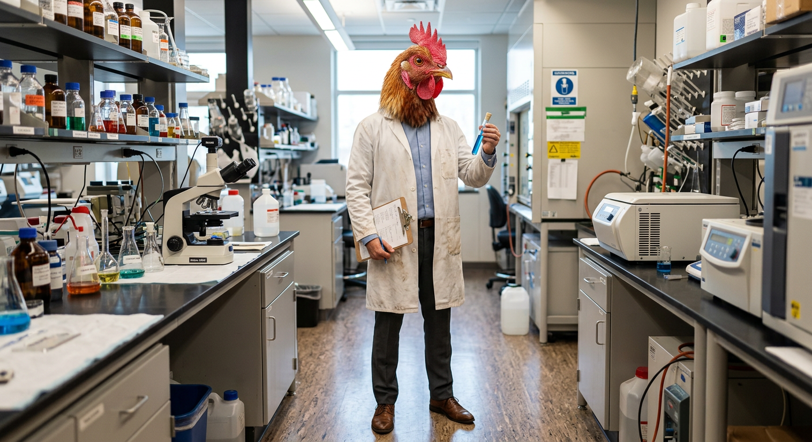

# Intro

_It's better to fail big than succeed small._



- primer design
- plasmid construction
- annotation
- cloning simulation
- checking constructs

# SnapGene Agent

## Overview

We are building an AI agent that can understand natural-language molecular biology requests and execute them as reproducible sequence-engineering workflows, while integrating with SnapGene for visualization and SnapGene-specific GUI operations.

The goal is **not to recreate SnapGene**. Instead, we combine:

1. **An AI agent** for planning and executing workflows.
2. **A molecular biology engine** for sequence manipulation, analysis, design, and validation.
3. **A SnapGene integration layer** using the SnapGene CLI and GUI automation where necessary.

The agent should be able to go from a request such as:

> "Replace GFP with mCherry, add the CMV promoter, check for BsaI sites, validate the construct, and open it in SnapGene."

to a complete, validated construct and corresponding SnapGene file.

---

## Architecture

```text
                    ┌────────────────────┐
                    │       AI AGENT      │
                    │                    │
                    │ Natural language   │
                    │ Planning            │
                    │ Tool selection      │
                    │ Workflow execution  │
                    └─────────┬──────────┘
                              │
                         MCP / Tools
                              │
              ┌───────────────┴───────────────┐
              │                               │
              ▼                               ▼
   ┌──────────────────────┐        ┌──────────────────────┐
   │ MOLECULAR BIOLOGY    │        │ SNAPGENE INTEGRATION │
   │ ENGINE               │        │                      │
   │                      │        │ CLI                  │
   │ Sequence editing     │        │ File conversion      │
   │ Feature annotation   │        │ Map rendering        │
   │ Primer design        │        │ GUI automation       │
   │ Assembly             │        │ SnapGene workflows   │
   │ Restriction analysis │        │                      │
   │ Validation           │        │                      │
   └──────────┬───────────┘        └──────────┬───────────┘
              │                               │
              └──────────────┬────────────────┘
                             ▼
                    ┌─────────────────┐
                    │ Sequence files  │
                    │ GenBank / .dna  │
                    │ FASTA / JSON    │
                    └─────────────────┘
```

## Core principle

**The molecular biology engine must not depend on SnapGene.**

Biological operations should be executable independently using structured sequence data. SnapGene is an integration target, visualization tool, and GUI-based execution layer for functionality that is not exposed through its CLI.

The canonical interchange format should be **GenBank plus a structured JSON representation** of constructs.

---

# Team Responsibilities

## Person 1 — SnapGene Integration

Own everything that interacts directly with SnapGene.

The Windows MVP adapter is implemented in [`snapgene/`](snapgene/README.md),
including setup, CLI utilities, map export, live tests, and teammate handoffs.

### Responsibilities

- SnapGene CLI wrapper
- `.dna` ↔ GenBank/FASTA conversion
- DNA map rendering
- Opening files in SnapGene
- GUI automation
- SnapGene-specific workflows
- Window/dialog detection
- Error handling and retries
- Automation of functionality unavailable through the CLI

### Target interface

Other components should be able to call simple operations such as:

```python
snapgene.open(path)
snapgene.convert(input, output)
snapgene.render_map(input, output)
snapgene.run_workflow(...)
```

The rest of the application should not need to know how SnapGene is being automated internally.

---

## Person 2 — Molecular Biology Engine

Own all sequence and molecular-biology logic.

### Responsibilities

- GenBank/FASTA parsing and writing
- Sequence manipulation
- Feature/annotation management
- Primer management
- Primer design
- Restriction-site analysis
- ORF detection
- Translation
- PCR simulation
- Gibson assembly
- Golden Gate assembly
- Restriction cloning
- Construct validation
- Biological constraints and rules

The biology engine must be usable without SnapGene running.

Example:

```python
construct = load_construct("plasmid.gb")

construct = replace_region(
    construct,
    target="GFP",
    replacement="mCherry"
)

construct = add_feature(
    construct,
    feature=cmv_promoter
)

validate_construct(construct)

save_construct(construct, "result.gb")
```

---

## Person 3 — AI Agent / MCP / Orchestration

Own the AI-facing system.

### Responsibilities

- Natural-language understanding
- Workflow planning
- MCP/tool definitions
- Tool selection
- Agent state
- Multi-step execution
- Validation before destructive operations
- Error recovery
- User-facing responses
- End-to-end integration tests

Example tool set:

```text
read_construct()
modify_sequence()
add_annotation()
remove_annotation()
find_restriction_sites()
design_primers()
simulate_pcr()
assemble_gibson()
assemble_golden_gate()
validate_construct()

snapgene_open()
snapgene_convert()
snapgene_render()
snapgene_run_workflow()
```

---

# Shared Data Model

All three components communicate through a shared construct representation.

Example:

```json
{
  "name": "pExample",
  "sequence": "ATGC...",
  "topology": "circular",
  "features": [
    {
      "name": "CMV",
      "type": "promoter",
      "start": 100,
      "end": 650,
      "strand": 1
    }
  ],
  "primers": [],
  "metadata": {}
}
```

The exact schema must be defined and agreed upon before major implementation begins.

---

# Development Strategy

The three components should be developed independently against the shared schema.

```text
                Shared Schema
                     │
        ┌────────────┼────────────┐
        ▼            ▼            ▼
     Agent        Biology      SnapGene
     Layer         Engine       Layer
        │            │            │
        └────────────┼────────────┘
                     ▼
              Integration Tests
```

Avoid coupling the biology engine directly to SnapGene or making the agent dependent on SnapGene's internal implementation.

Every major operation should have:

- A structured input
- A structured output
- Validation
- Clear errors
- Unit tests
- Integration tests where appropriate

---

# Project Goal

The final system should allow a user to describe complex molecular-biology tasks in natural language and have the agent:

1. Understand the requested operation.
2. Inspect existing constructs.
3. Plan the required operations.
4. Modify/analyze sequences.
5. Design primers or assemblies when required.
6. Validate the resulting construct.
7. Generate the appropriate sequence files.
8. Convert/render them through SnapGene when useful.
9. Execute SnapGene-specific GUI workflows when required.
10. Return the resulting construct and a clear record of what was performed.

The system should be **modular, reproducible, testable, and independent of SnapGene wherever possible**.

## MVP MCP server

Person 3's MVP lives in `agent/`. It exposes an MCP server to Codex and keeps
the host model responsible for natural-language planning while the server owns
typed tools, validation gates, and the reproducible operation log.

Install the project dependencies and run the server over stdio:

```bash
python -m venv .venv
.venv/bin/python -m pip install -e .
.venv/bin/dna-maker-mcp
```

See [CONTRACT.md](CONTRACT.md) for the adapter contract and
[`agent/prompts/codex_instructions.md`](agent/prompts/codex_instructions.md) for
the tool-use policy. The server intentionally returns `biology_unavailable` or
`snapgene_unavailable` until the two component owners inject their adapters.

For the complete setup, tool reference, deterministic/manual usage, Codex
configuration, Windows SnapGene runbook, and troubleshooting guide, see
[`MCP_MANUAL.md`](MCP_MANUAL.md).

For the shortest usage guide, see [`MCP_QUICKSTART.md`](MCP_QUICKSTART.md).

For integration, each component owner exposes a zero-argument factory and the
MCP process is started with these environment variables:

```bash
DNA_MAKER_BIOLOGY_ADAPTER='dnamaker.service:create_biology_adapter'
DNA_MAKER_SNAPGENE_ADAPTER='snapgene.adapter:create_service'
```

The factories must return implementations of the interfaces in
[`agent/adapters.py`](agent/adapters.py).

The biology adapter uses the current working directory as its workspace by
default. Set `DNA_MAKER_WORKSPACE` to use a shared workspace explicitly; set
`DNA_MAKER_BIOLOGY_ARTIFACT_DIR` to override the relative mutation-artifact
directory when needed.

---

## SnapGene Demo Prompts

### 1. Replace EGFP with mCherry

> Read inputs/pEGFP-N1.gb. Read the mCherry CDS sequence from inputs/mCherry.gb in the workspace and use it to replace
> the EGFP feature, labeling the replacement mCherry. Scan for EcoRI sites and validate. Save as outputs/demo1-mCherry.gb,
> reload and revalidate that saved file, convert to outputs/demo1-mCherry.dna, export outputs/demo1-mCherry.png,
> and open the converted file last. Report artifact paths and any errors. This is direct sequence
> replacement, not Gibson assembly.

### 2. Annotate without changing the sequence

> Read inputs/pEGFP-N1.gb. Add a forward-strand misc_feature named “Demo annotation” at zero-based, end-exclusive
> coordinates [590, 671), without changing the DNA sequence. Validate, save as outputs/demo2-annotated.gb, reload and
> revalidate, convert to outputs/demo2-annotated.dna, export outputs/demo2-annotated.png, and open the converted file
> last.

### 3. Inspect without modifying

> Read inputs/pEGFP-N1.gb. Report its length, topology, and annotated features. Find EcoRI and BamHI restriction
> sites, clearly stating the coordinate convention. Run validation and report each check, then show the workflow
> status. Do not modify, save, or open any files.
